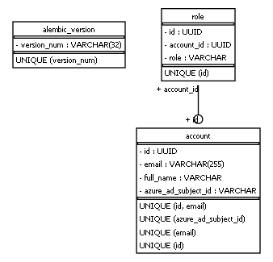
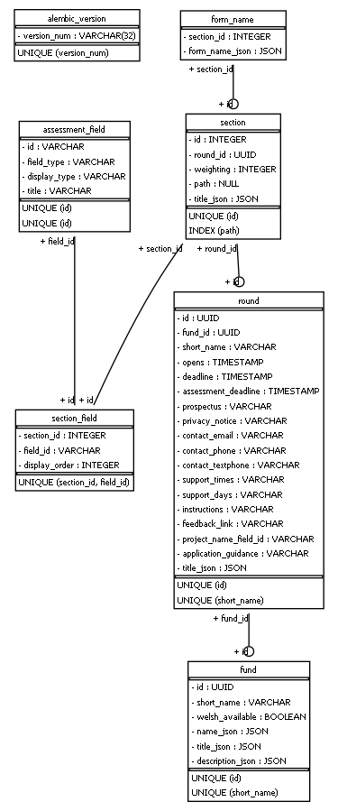
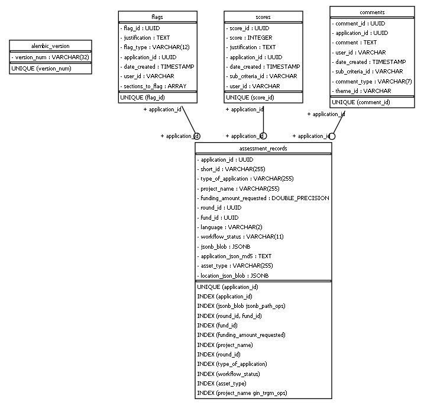
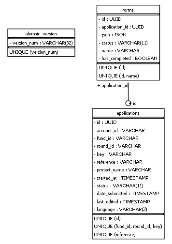

# funding-service-design-erd

## Setup

Install graphviz and add bin to path: https://graphviz.org/download/

```bash
python -m venv .venv
.venv/Scripts/python -m pip install -r requirements.txt
.venv/Scripts/python create_erd_images.py
```

## Diagrams

<!-- ERD Start -->

### Account_store:


### Fund_store:


### Assessment_store:


### Application_store:


<!-- ERD End -->
